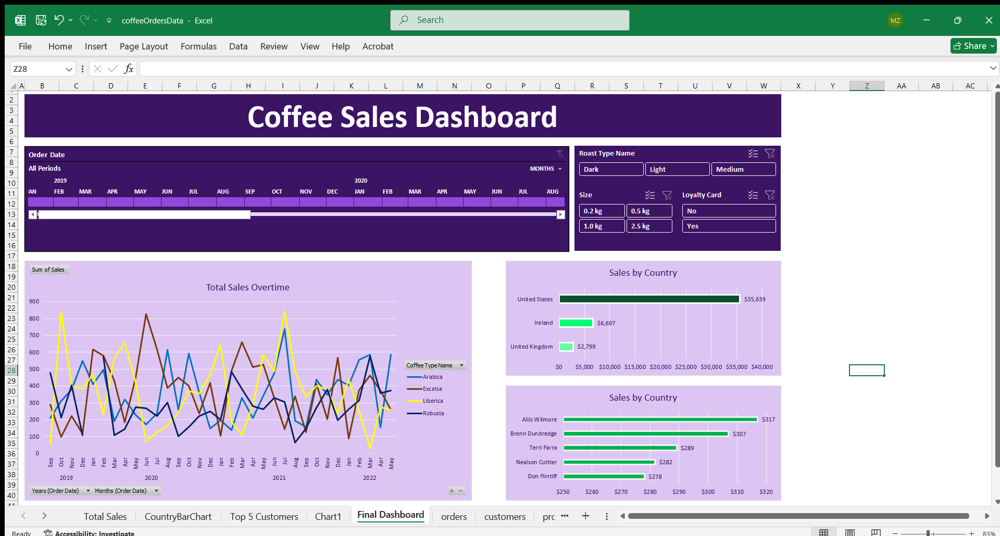

# ☕ Coffee Sales Dashboard (Excel Project)

This project is an **interactive Excel dashboard** for visualizing coffee sales data across multiple dimensions such as country, customer, roast type, package size, and loyalty program status.

---

## 📊 Features

- 📆 **Date Filtering**: Filter sales data from 2019 to 2022 by month and year
- 🌍 **Sales by Country**: Visual comparison of sales across different countries
- 👤 **Top Customers**: Identify top customers based on purchase value
- ☕ **Sales by Coffee Type**: Line chart showing trends in Arabica, Robusta, Liberica, and Excelsa sales
- 📦 **Filters**: Slicers for Roast Type, Size (0.2kg to 2.5kg), and Loyalty Card usage
- 🎨 **Clean UI**: Professionally styled dashboard with a user-friendly layout

---

## 📂 Project Files

- `coffeeOrdersData.xlsx`: The main Excel file containing the dashboard, data, and charts

---

## 🛠 Tools Used

- Microsoft Excel
- PivotTables
- Slicers
- PivotCharts
- Conditional Formatting

---

## 📌 How to Use

1. Open `coffeeOrdersData.xlsx` in Excel
2. Use the slicers at the top to filter by:
   - Roast Type (Dark, Light, Medium)
   - Size (0.2kg – 2.5kg)
   - Loyalty Card (Yes/No)
3. Explore insights in the charts and tables below:
   - Total Sales Over Time
   - Sales by Country
   - Sales by Top Customers

---

## 💡 Insights

- The **United States** leads in total coffee sales.
- **Arabica** and **Excelsa** are the most purchased coffee types.
- Significant seasonal patterns in coffee sales are observed over the years.

---

## 📎 Screenshot

---

## 📬 Contact

For any queries or collaborations, feel free to reach out via [LinkedIn Profile](https://www.linkedin.com/in/mdzaidabidkhan).

---

